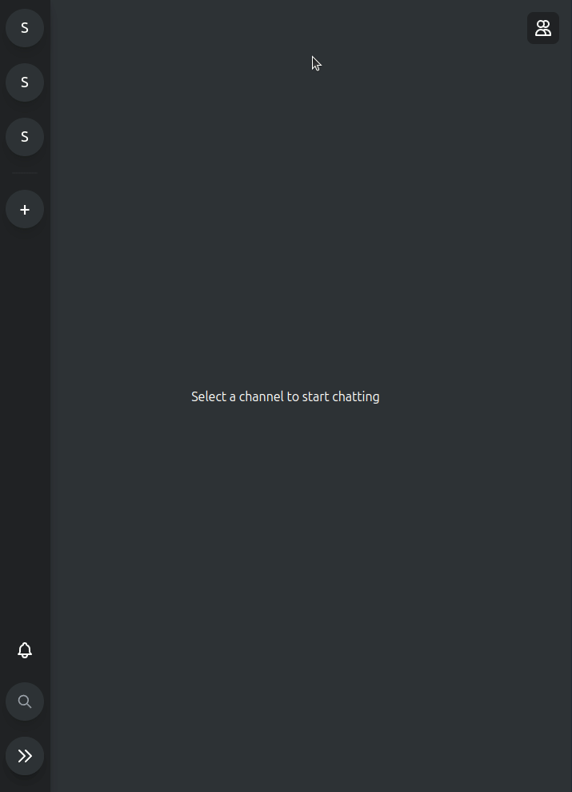
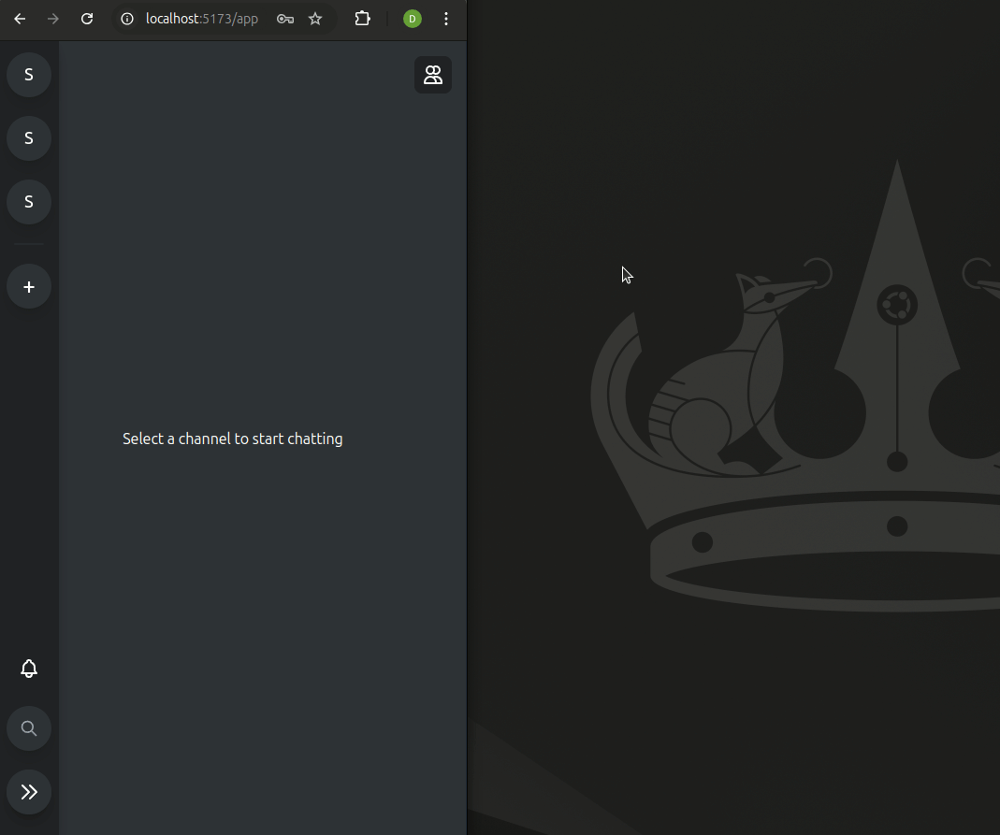
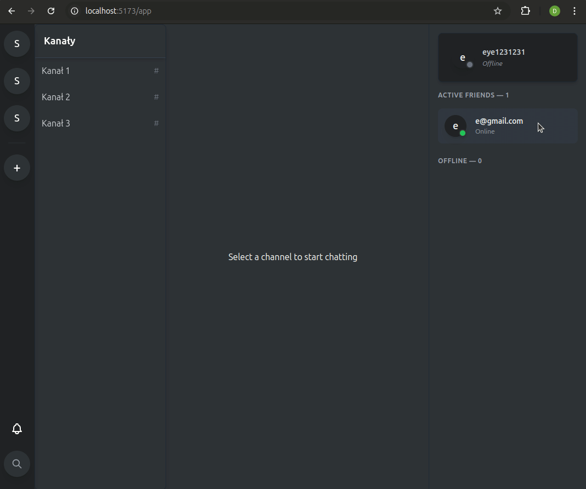
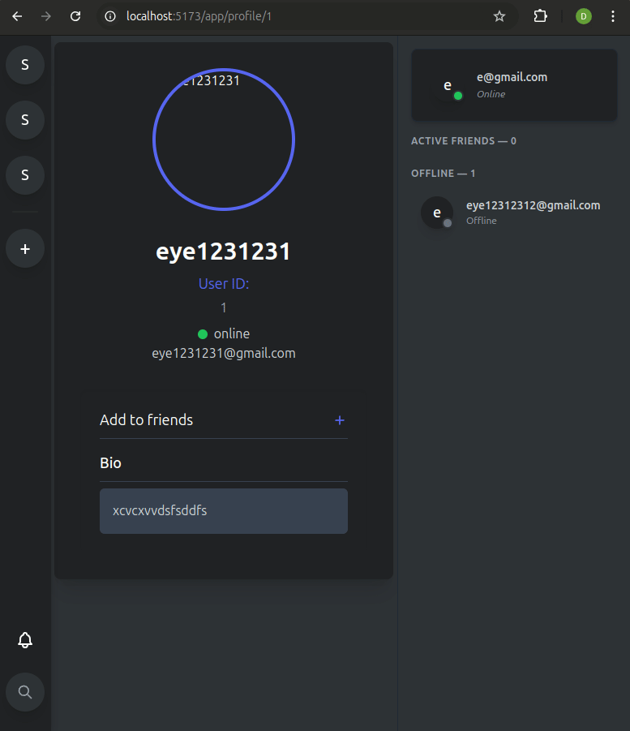

# Chat-app - Frontend

A Discord-inspired web application built with React and Redux. Features real-time communication, friend management, and notifications.

## Backend Django-Channels-Redis-ORM-JWT
- This app is client side only, for the backend you can check the repo listed below
- in this repo you can find the api documentation in the docs folder
- when python manage.py runserver is running you can check the api at http://localhost:8000/api/redoc
- More info https://github.com/no-ppp/discord-clone-backend

## 🌟 Core Features

### Landing Page


### Login Page


### Single Server Page


### Responsive Design



### Friend Management
- Send friend requests (completed works with django-channels + redis)
- Accept/reject friend requests (completed works with django-channels + redis)
- View online status (completed works with django-channels + redis)
- Remove friends (completed works with django-channels + redis)



### Real-time Chat
- Send/receive messages instantly   (in development)
- Message status indicators          (in development)
- Typing indicators                 (in development)
- Message history                  (in development)

### Notification System
- Real-time notifications           (works with django-channels + redis)
- Friend request notifications       (works with django-channels + redis)
- Message notifications              (works with django-channels + redis)
- Mark as read/unread                (works with django-channels + redis)
- Clear notifications                (works with django-channels + redis)



### User Authentication      (works with django-rest-framework + jwt)
- JWT-based authentication   (django-channels have custom middleware for this)
- Protected routes
- Persistent sessions
- Secure password handling

## 🔧 Development

### Prerequisites
- Node.js 16+
- npm or yarn
- Modern web browser


## 🛠️ Technologies

- **React** - UI library
- **Redux Toolkit** - state management
- **WebSocket** - real-time communication
- **TailwindCSS** - styling
- **React Router** - routing
- **date-fns** - date formatting

## 📦 Installation

1. Clone the repository:
```bash
git clone https://github.com/your-username/discord-clone-frontend.git
```
2. Install dependencies:
bash
npm install
```
3. Start the development server:
```bash
npm run dev
```
## 🔧 Configuration

### Environment Variables

Create a `.env` file in the root directory with the following variables:

```
VITE_API_URL=http://localhost:8000
```

## 📁 Project Structure

```
src/
├── api/                  # API requests
├── components/           # React components
│   ├── auth/            # Authentication components
│   ├── features/        # Main features
│   ├── leftsidebar/     # Left sidebar components
│   └── rightsidebar/    # Right sidebar components
├── store/               # Redux store
│   ├── actions/         # Redux actions
│   ├── middleware/      # Middleware (WebSocket)
│   └── slices/          # Redux slices
├── hooks/               # Custom hooks
├── utils/               # Utility functions
├── websockets/          # WebSocket configuration
├── App.jsx              # Main component (Landing page)
└── MainApp.jsx          # Main application component (includes routing)
```


## 🔌 WebSocket

The application uses WebSocket for:
- Online status updates
- Real-time notifications
- Chat message(future)
- Servers(future)

## 📚 Documentation

For more detailed information, please refer to the [Backend Documentation](https://github.com/no-ppp/discord-clone-backend/docs).

## 🔒 Authentication

The application uses JWT tokens for authorization. The token is stored in localStorage and attached to:
- HTTP requests in the Authorization header
- WebSocket connection as a URL parameter with custom middleware in the backend

## 🎨 Styling

The project uses TailwindCSS

## 📱 Responsiveness

The application is fully responsive with breakpoints:
- Mobile: < 768px
- Tablet: 768px - 1024px
- Desktop: > 1024px

## 📝 TODO

- [ ] Add voice messages system
- [ ] Implement servers and channels
- [ ] User permissions system
- [ ] Extend notification system

## 🔌 WebSocket Events

### Status Updates
```javascript
{
    type: 'status_update',
    user_id: number,
    status: 'online' | 'offline'
}
```

### Notifications
```javascript
{
    type: 'notification',
    notification: {
        id: number,
        text: string,
        created_at: string,
        is_read: boolean,
        notification_type: 'friend_request' | 'message'
    }
}

for more info check the backend repo listed at the top of the README
the api documentation is in the backend repo (docs folder)
when python manage.py runserver is running you can check the api at http://localhost:8000/api/redoc
```

## 🚀 Available Scripts

```bash
npm run dev        # Start development server
npm run build      # Build for production
npm run preview    # Preview production build
```

## 🐛 Known Issues

- WebSocket reconnection handling needs improvement
- Mobile notifications might be delayed on background


## 📝 Notes

- The project is still in development and some features may not work as expected.
- The backend is not yet fully implemented, so some features may not be available.
- The project is not yet fully tested, so some bugs may occur.

